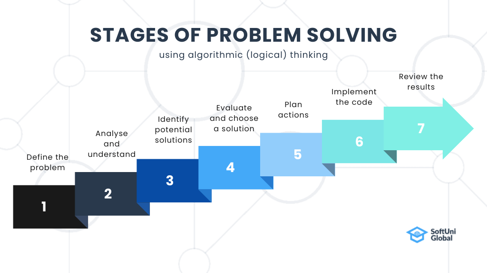

<h1 align="center">Problem Solving</h1>
<div align="center">
<!-- Gmail Account -->
<a href="mailto:jayed.swe@gmail.com">

</a>
<a href="tel:+8801987132107">

<a href="#" target="_blank">

</a>
<a href="https://www.facebook.com/jibon969" target="_blank">


<a href="https://www.linkedin.com/in/jibon969/" target="_blank">

</a>
<a href="https://github.com/jibon969" target="_blank">

</a>
</div>

<hr/>

#### 01. Add Two Numbers

```
Input: num1 = 5, num2 = 10
Output: 15
Explanation: 5 + 10 = 15

Complexity Analysis
    Time Complexity: O(1)
    Auxiliary Space: O(1)
```

<details><summary style="cursor:pointer">Solution</summary>

```py
num1 = 5;
num2 = 10;
sum = num1 + num2;
print(sum) // Output: 15
```
</details>

#### 02. Find Maximum of two numbers in Python

```
Input: num1 = 5, num2 = 10
Output: 10
Explanation: 5, 10 ---> Here 10 is maximum
Complexity Analysis
    Time Complexity: O(1)
    Auxiliary Space: O(1)
```
<details>
<summary style="cursor:pointer">Solution</summary>

```py
num1 = 5
num2 = 10
if num1 >= num2:
    print(f"{num1} Maximum")
else:
    print(f"{num2} Maximum")
```
</details>

#### 03. Find the Factorial of a Number

```
Input  : 5
Output : 120
Explanation: 5! = 5*4*3*2*1
Complexity Analysis
    Time Complexity: O(1)
    Auxiliary Space: O(1)
```
<details>
<summary style="cursor:pointer">Solution</summary>

```py
def factorial_number(n):
    f = 1
    for i in range(1, n+1):
        f = f * i
        return f
result = factorial_number(5)
print(result)
```
</details>


---
**[⬆ Back to Top](#header)**
